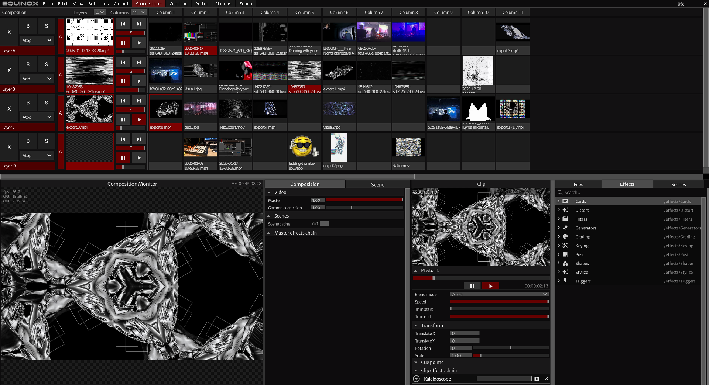
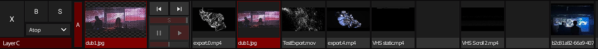
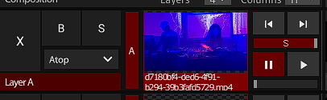
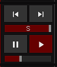
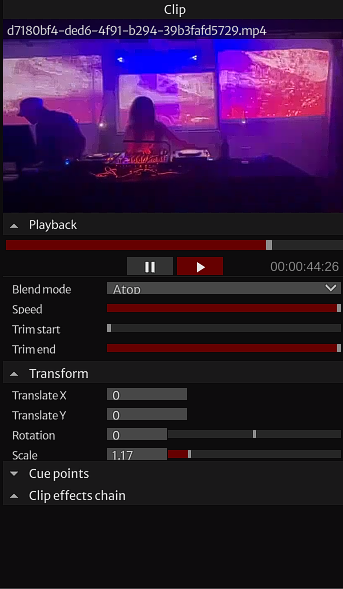
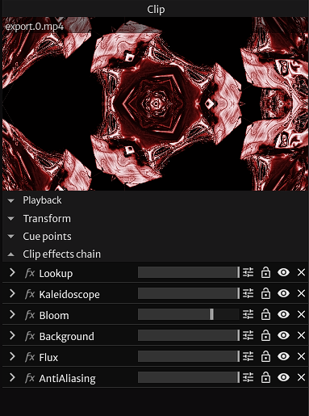

# Compositing

The compositor blends multiple layers of media, such as videos and graphics, into one final output. Compositing is used for programmable visual effects and overlaying graphics. Each layer is blended with the previous layer.

 
<small>The compositor, with 4 layers and multiple clips loaded.</small>

## Layers

 

A layer is a collection of compiled clips, where each layer plays one clip. Layers are equipped with their own effects chain, where effects can be applied onto the layer before blending.

## Adding clips

 

To add clips, simply drag a file from a file explorer into an empty clip slot. To remove the clip, hover over the clip slot and click the "X" on the top-right.

## Controls

### Mixing

 

- **B** — Bypasses the layer from composition.
- **S** — Solos the layer, bypassing all other layers from composition.
- **X** — Removes the clip and any effects in its FX chain.

The alpha slider controls the alpha of the clip. 

### Blend mode

You can customize how layers are blended together by changing the blend mode. The blend mode determines how layers are overlaid with each other.

### Playback controls

Each layer has a set of playback controls that control video playback. From top to bottom, are the controls listed:

- **Play/pause** —  Controls whether the layer's clip is actively playing.

- **Speed slider** —  Adjusts the playback rate of the current clip. Greater values speeds up playback, and vice versa.

- **Skip buttons** —  transverse through the layer's clips. By default, it skips over empty clip slots.

- **Scrubber** —  shows the clip progress, and acts as a mini-scrubber.

### Clip manager

 

On the lower deck of the VJ, next to the effects library, is the clip manager. The clip manager has configurations for playback, transform and the effects chain.

### Playback

- **Blend mode** — Controls how the clip blends with the layers beneath it. Different blend modes interact with colos
- **Speed** — Adjusts the playback rate of the current clip. Greater values speeds up playback, and vice versa.es below 1x slow it down. Negative values play the clip in reverse.
- **Trim start** — Sets how much of the beginning of the clip is cut off before playback begins. Increasing this value causes playback to start further into the clip.
- **Trim end** — Sets how much of the end of the clip is cut off. Decreasing this value causes playback to stop earlier, shortening the effective clip length.

### Transform

- **Translate X** — Moves the clip horizontally along the x-axis.
- **Translate Y** — Moves the clip vertically along the y-axis.
- **Rotation** — Rotates the clip around its center point, measured in degrees. Values range from 0° to 360°.
- **Scale** — Resizes the clip uniformly. Greater values enlarge the clip, and vice versa.

### Cue points

TBA

## Effects chain

Each layer has its own effects chain, where different effects can be applied onto a layer. Effects are processed before the layer is composited. 

To add effects onto an FX chain, navigate to the effects library and drag the effect onto the FX chain. 

 
<small>Look at this cool kalediscope!</small>