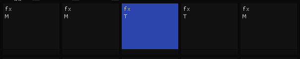
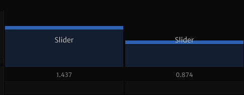

# Macros

The macro system is a collection of controllers that output a signal. Macros can be programmed to modulate multiple effects and parameters simultaneously, on command.

### Triggers

 

Triggers are macros that have an on/off state. There are two types of triggers: momentary and toggle.

### Knobs & Sliders

 

Knobs and sliders are used for fine control of parameters.

### Adding macro exports

To add a parameter for a macro to export to, drag the parameter onto the macro. The macro will export its signal to the parameter.

To configure a macro's exports, right-click on the macro and select 'View exports'. A window will open, showing all the macro's exports. You can enable, disable or delete them.

### Configuring macros

To configure macros, right-click on the macro and select 'Macro options'. This will bring up a menu of parameters for the macro.

#### Options

- __Name__ - Name of macro
- __Color__ - Adjust hue of macro
- __Min__ - Clamp min value

#### MIDI LINK

Macros can be bound to a midi channel. Steps:

1. Turn on MIDI Learn (found on the top bar of the VJ)

2. Click on the macro you wish to bind.

3. Interact with the desired MIDI controller. The macro will automatically be bound to the corresponding MIDI channel.

### Macro presets

TBA

